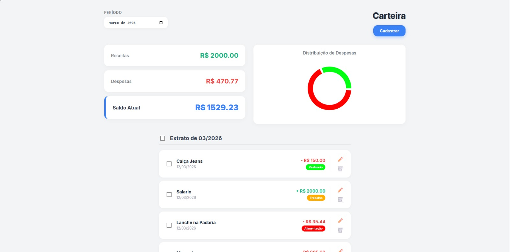
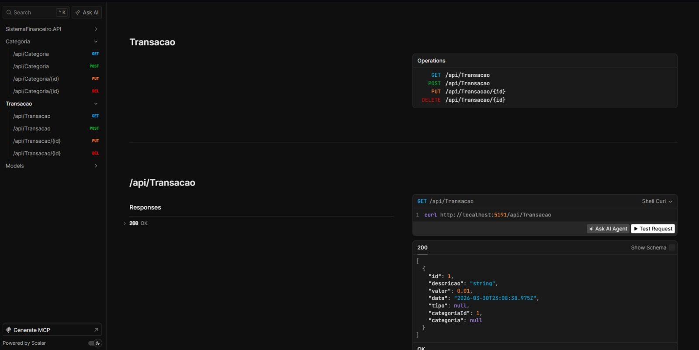

# 💰 FinanceAPI — Controle Financeiro Pessoal

> Aplicação fullstack para controle financeiro pessoal. O **backend** é uma API RESTful desenvolvida em **C# com ASP.NET Core**, e o **frontend** foi construído em **React**. Permite gerenciar receitas e despesas, organizar por categorias e visualizar o resumo financeiro por período.

---

## 🚀 Demonstração

> 🔧 *Em breve: link do deploy*

---

## 🧰 Tecnologias Utilizadas

### Backend
| Tecnologia | Uso |
|---|---|
| C# / ASP.NET Core | Framework principal da API |
| PostgreSQL | Banco de dados relacional |
| Entity Framework Core | ORM para acesso ao banco |
| Scalar | Documentação interativa da API |

### Frontend
| Tecnologia | Uso |
|---|---|
| React | Interface do usuário |
| JavaScript | Linguagem do frontend |

---

## ✅ Funcionalidades

- [x] Cadastro de **receitas e despesas**
- [x] Organização por **categorias de gastos**
- [x] **Dashboard** com resumo financeiro por período
- [x] Interface visual em **React**
- [x] Documentação interativa com **Scalar**
- [ ] Autenticação JWT *(em desenvolvimento)*
- [ ] Deploy em produção *(em breve)*

---

## 🗂️ Estrutura do Projeto

```
FinanceApp/
├── backend/
│   ├── Controllers/        # Endpoints da API
│   ├── Models/             # Entidades do banco de dados
│   ├── DTOs/               # Objetos de transferência de dados
│   ├── Services/           # Regras de negócio
│   ├── Repositories/       # Acesso ao banco de dados
│   ├── Data/               # Contexto do Entity Framework
│   └── Program.cs          # Configuração da aplicação
└── frontend/
    ├── src/
    │   ├── components/     # Componentes React
    │   ├── pages/          # Páginas da aplicação
    │   └── services/       # Chamadas à API
    └── package.json
```

---

## ⚙️ Como Rodar Localmente

### Pré-requisitos

- [.NET 8 SDK](https://dotnet.microsoft.com/download)
- [Node.js](https://nodejs.org/) (v18+)
- [PostgreSQL](https://www.postgresql.org/download/)
- [Git](https://git-scm.com/)

### Backend

```bash
# 1. Clone o repositório
git clone https://github.com/MJunior10/CarteiraFinanceira
cd CarteiraFinanceira/SistemaFinanceiro.API

# 2. Configure a string de conexão no appsettings.json
# "ConnectionStrings": {
#   "DefaultConnection": "Host=localhost;Database=financedb;Username=SEU_USER;Password=SUA_SENHA"
# }

# 3. Aplique as migrations
dotnet ef database update

# 4. Rode a API
dotnet run

# 5. Acesse a documentação Scalar
# http://localhost:5191/scalar
```

### Frontend

```bash
# Em outro terminal, na pasta frontend
cd ../frontend

# Instale as dependências
npm install

# Rode o projeto
npm run dev

# Acesse no navegador
# http://localhost:5173
```

---

## 📡 Principais Endpoints

### Transações

| Método | Rota | Descrição |
|--------|------|-----------|
| `GET` | `/api/transacoes` | Lista todas as transações |
| `GET` | `/api/transacoes/{id}` | Busca transação por ID |
| `POST` | `/api/transacoes` | Cria nova transação |
| `PUT` | `/api/transacoes/{id}` | Atualiza transação |
| `DELETE` | `/api/transacoes/{id}` | Remove transação |

### Categorias

| Método | Rota | Descrição |
|--------|------|-----------|
| `GET` | `/api/categorias` | Lista todas as categorias |
| `POST` | `/api/categorias` | Cria nova categoria |

### Dashboard

| Método | Rota | Descrição |
|--------|------|-----------|
| `GET` | `/api/dashboard` | Retorna resumo financeiro do período |

---

## 📸 Screenshots

> *Adicione aqui prints do frontend e da documentação Scalar*
>
> ```markdown
> 
> 
> ```

---

## 🧠 O que aprendi neste projeto

- Desenvolvimento de API RESTful com ASP.NET Core
- Integração com PostgreSQL via Entity Framework Core
- Separação de responsabilidades: Controllers, Services, Repositories
- Documentação de APIs com Scalar
- Construção de interface com React consumindo API própria
- Versionamento com Git e GitHub

---

## 🔮 Próximos Passos

- [ ] Implementar autenticação com JWT
- [ ] Adicionar testes unitários com xUnit
- [ ] Deploy do backend no Railway ou Render
- [ ] Deploy do frontend na Vercel
- [ ] Melhorar validações nos DTOs

---

## 👨‍💻 Autor

**Mauro Junior**

[](https://linkedin.com/in/mauro-junior-29b997215)
[](https://github.com/MJunior10)

---

> 💡 *Este projeto foi desenvolvido para fins de aprendizado e portfólio pessoal.*
